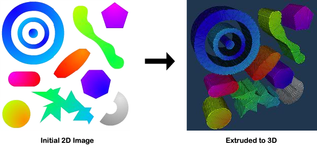
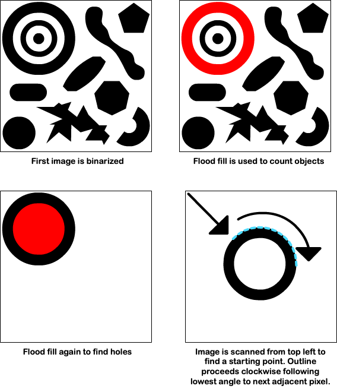
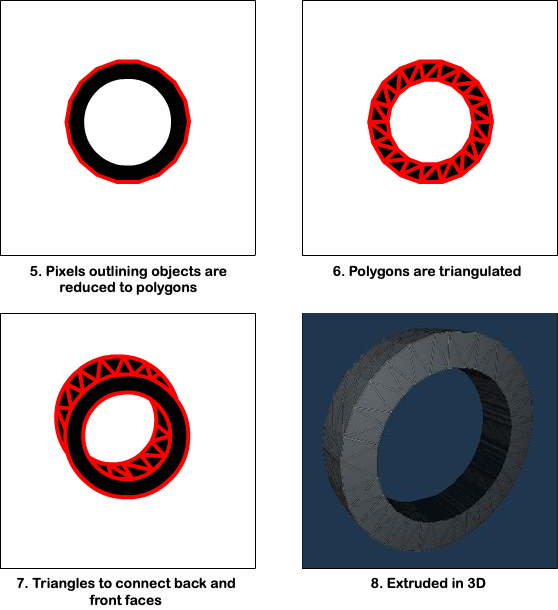

# Extrude

Extrudes an image into a 3D model in c++ with no external dependencies. Sample VS Code project that uses the single header file sokol libraries for rendering the extruded model.

asm.js/wasm live demo: https://stevinz.github.io/extrude-html5/

## Screenshots:

## Methodology:

1. Image is loaded into an array and binarized based on the alpha channel (with an adjustable tolerance). 
2. Objects are found using flood fill and removed from original image. This is repeated until the entire image has been scanned.
3. Holes within each object are found using additional flood fills. 
4. Polygons are formed by outlining the resulting objects. The outlining algorithm starts at the top left of an image and scans down and to the right until a pixel is hit. It then proceeds, in a clockwise rotation, to the next adjacent pixel found with the smallest angle between that pixel and the current position.  

 

5. The resulting list of points, stored as a polygon, is then simplified using the Ramer-Douglas-Peucker algorithm. This polyline simplification algorithm reduces points that fall along the same lines.
6. The simplified outline polygon, along with a list of any hole polygons, is fed into an optimal polygon triangulation algorithm to form the front and back faces. 
7. Triangles are added to connecct the front and back faces, forming the sides. 
8. 3D!  

 

## Thanks to these libraries used during extrusion:

- Handmade-Math (CC0): https://github.com/StrangeZak/Handmade-Math
- Mesh Optimizer (MIT): https://github.com/zeux/meshoptimizer 
- Poly Partition (MIT): https://github.com/ivanfratric/polypartition
- Ramer-Douglas-Peucker (CC0): https://gist.github.com/TimSC/0813573d77734bcb6f2cd2cf6cc7aa51
- Stb_image (MIT): https://github.com/nothings/stb

## Also thanks to these libraries used for the demo:

- Fontstash (Zlib): https://github.com/memononen/fontstash
- Sokol (Zlib): https://github.com/floooh/sokol
- Whereami (MIT): https://github.com/gpakosz/whereami